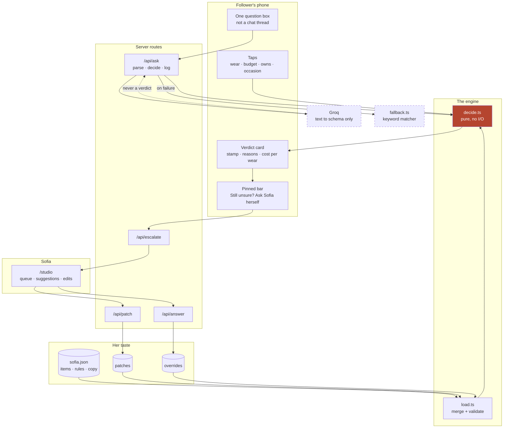
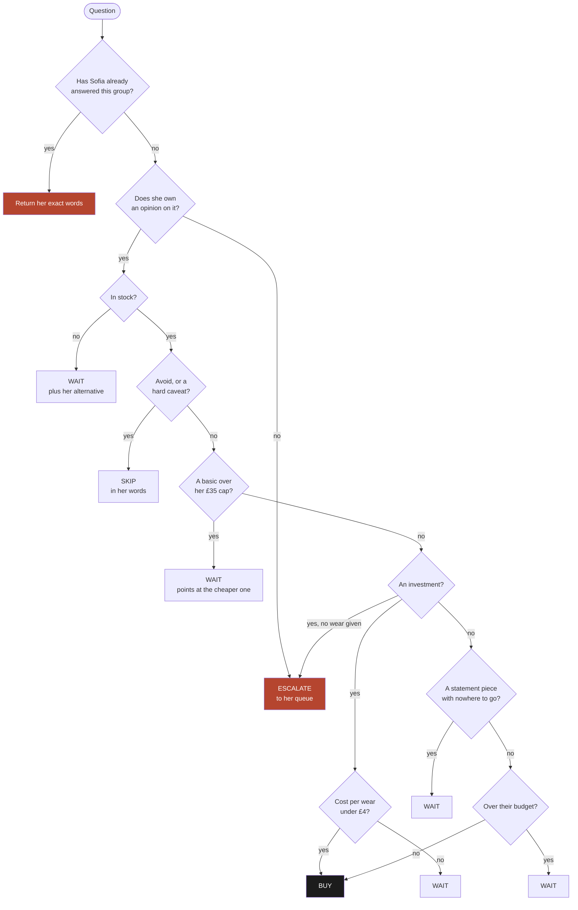
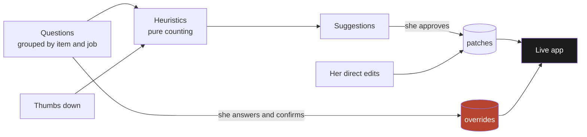

# Ask Sofia

**Her judgement, awake at 3am.**

Sofia Bennett is a London fashion creator with 50,000 followers who ask her the same handful of questions all day. They do not want a link, they want her opinion, and her opinion only exists while she is awake.

Ask Sofia turns her written rules into an instant personal verdict, sends anything it cannot answer to her, and learns only from what she approves.

Built in one day for the Tano Creator Heist, Case 002, Operation Lookbook.

[**Open the demo**](https://ask-sofia.vercel.app) · [Her studio](https://ask-sofia.vercel.app/studio) · [A verdict page](https://ask-sofia.vercel.app/s/black-blazer)

---

## The one idea

Most tools in this space put a language model in front of a creator's content and let it improvise. That fails the only test that matters, which is whether the creator would put her name on the answer.

Here the model never decides anything. **A pure rules engine gives every verdict, and the model only turns free text into a validated schema.** Her taste lives in data she can read and edit. When the engine is not confident it says so and asks her, rather than guessing.

That gives three properties worth more than cleverness:

- **Deterministic.** The same input always gives the same output. There is no retry button because there is nothing to re-roll.
- **Attributable.** Every reason on a verdict card is built from her own quotes and her own templates.
- **Reversible.** Nothing reaches the live app without her confirming it, and every change is a timestamped patch.

---

## Architecture



The dashed boxes are the parts allowed to fail. Groq falls back to the keyword matcher, Supabase falls back to in-memory state, and the engine runs in the browser, so **every screen still works with both of them down.**

---

## How a verdict is decided

`decide()` is a pure function. No network, no clock, no randomness. It walks these in order and the first one that matches wins.



Pairings are then the intersection of what she pairs it with and what they own, capped at three, because she only ever names three things she truly loves.

**Paid status is attached after the verdict is decided and no rule can read it.** A paid item and an identical unpaid one get the same call. There is a test that proves it.

---

## How it adapts

Three things change the live app. All three need her, and there is no fourth.



- **Her answer to a grouped question** becomes an override the moment she confirms it, word for word.
- **The heuristics** propose. The same answer three times in one group becomes a proposed rule, and a verdict with two or more thumbs down goes to review. They are arithmetic, not a model, so she can audit why something was suggested.
- **She decides.** Groq may draft the wording of a suggestion, but the heuristics choose what gets suggested and Sofia chooses what goes live.

**There is no learned model and no automatic learning from user behaviour.** Sofia is the model. The app is the inference engine, and escalation is how it says "I do not know" instead of inventing an answer.

---

## Getting it running

```bash
npm install
cp .env.example .env.local   # then fill it in
npm run dev
```

It runs with an empty `.env.local`. Groq drops to the keyword matcher and Supabase drops to in-memory state, which is the point.

| Command | What it does |
| --- | --- |
| `npm run dev` | Local dev server |
| `npm test` | Engine, loader and parser tests |
| `npm run eval` | Scores the parser against the twelve real DMs |
| `npm run seed` | Demo data so the studio is not empty |
| `npm run import -- file.csv` | Merges new items into `sofia.json` |

### Environment

| Variable | Secret | Notes |
| --- | --- | --- |
| `GROQ_API_KEY` | yes | Free text parsing only |
| `GROQ_MODEL` | no | `openai/gpt-oss-120b` |
| `NEXT_PUBLIC_SUPABASE_URL` | no | Project API endpoint |
| `SUPABASE_SERVICE_ROLE_KEY` | yes | Server routes only, never the browser |

Both secrets are read only inside server routes. Every table has row level security on with no policies, so the publishable key is denied on all five and only the service role gets through.

---

## Layout

```
data/sofia.json            items, rules, thresholds, quotes, UI copy, reason templates
lib/engine/decide.ts       the pure verdict function
lib/engine/types.ts        the contract everything agrees on
lib/data/load.ts           sofia.json, then patches, then overrides, validated with zod
lib/parse/groq.ts          free text to a validated schema
lib/parse/fallback.ts      keyword matcher for when Groq is not there
lib/suggest/heuristics.ts  what to propose to her, pure counting
lib/store.ts               Supabase over PostgREST, in-memory fallback
app/s/[item]/              the audience view
app/studio/                her desk
app/v/[ref]/               a shared verdict snapshot
tests/                     golden cases that must always pass
evals/                     the twelve real DMs and a scorer
```

## Testing

```
npm test
```

The golden cases are the contract, not coverage theatre. A blazer worn weekly buys. The grey knit skips on her own words, "soft but pills". A £60 white tee points at the £35 version. The slingback waits without an occasion. An unknown item escalates rather than guessing. A confirmed override beats the engine, overrides beat patches, and an invalid patch is rejected with an error naming the field while the previous state stays live.

The parser is scored separately against the twelve real DMs from the case file, not against invented examples.

## Notes

`CLAUDE.md` holds the full brief and the hard rules this build is held to. `DECISIONS.md` records every judgement call made along the way and why.
